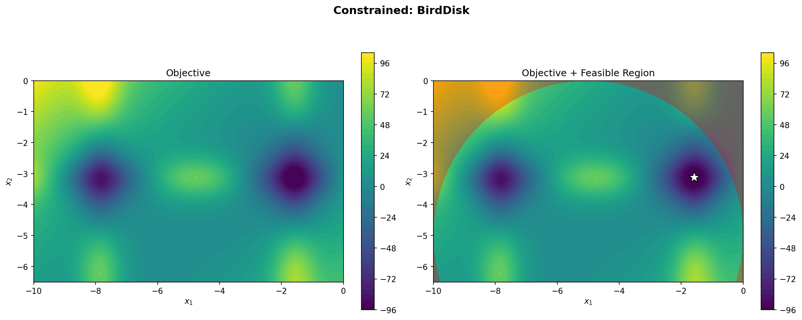
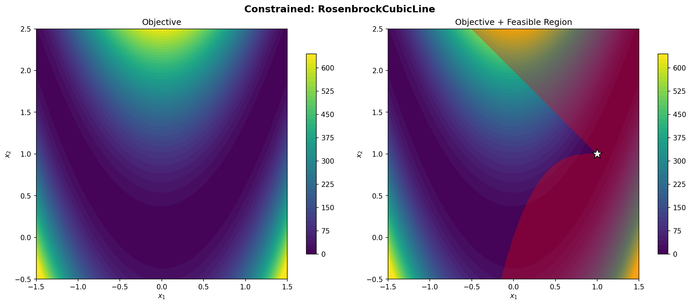
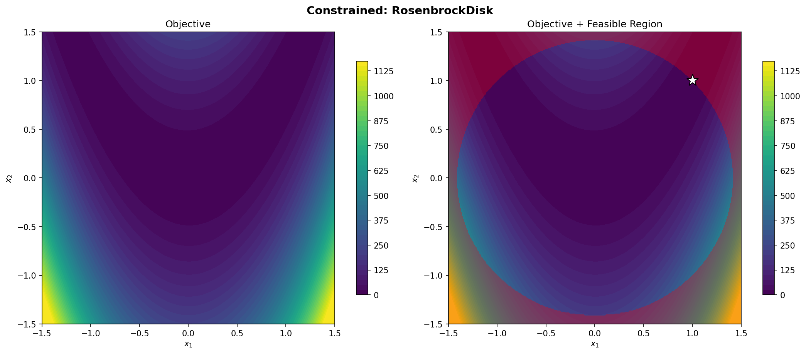
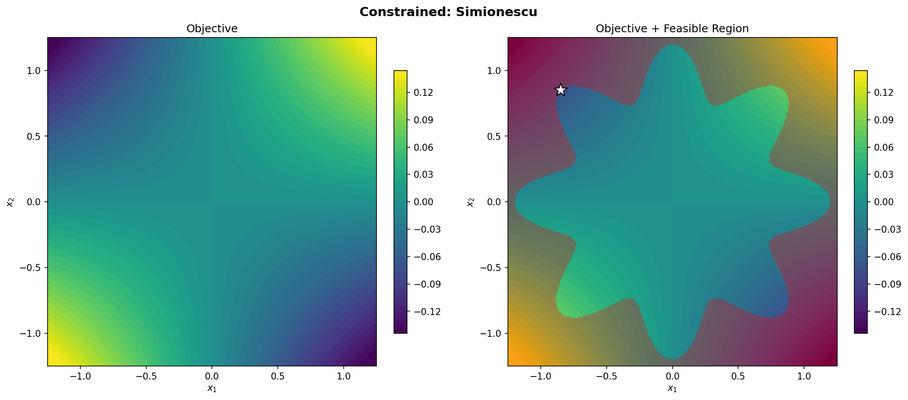
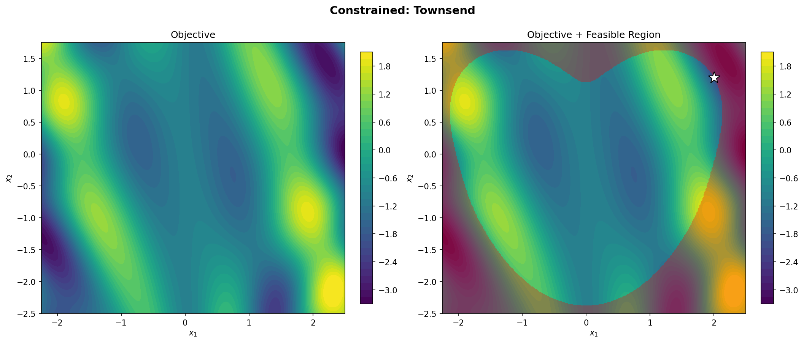

# Constrained Test Problems

Each figure shows the objective contour (left) and the objective with feasible region (right, infeasible in red). The white star marks the global optimum.

---

## BirdDisk

---

## RosenbrockCubicLine

---

## RosenbrockDisk

---

## Simionescu

---

## Townsend

---

