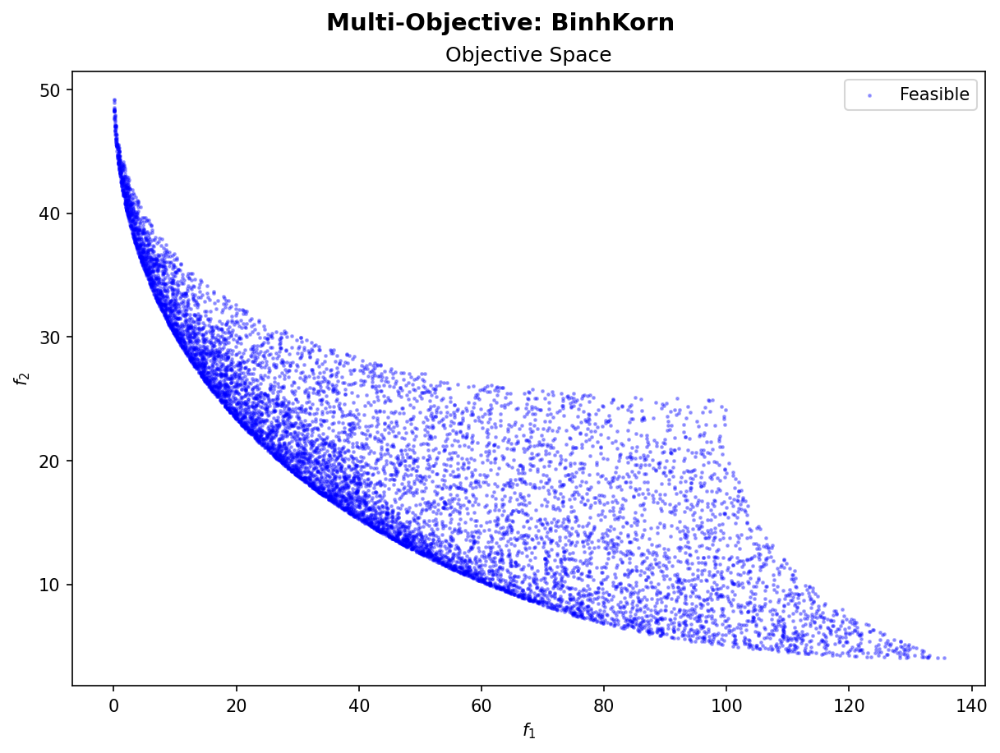
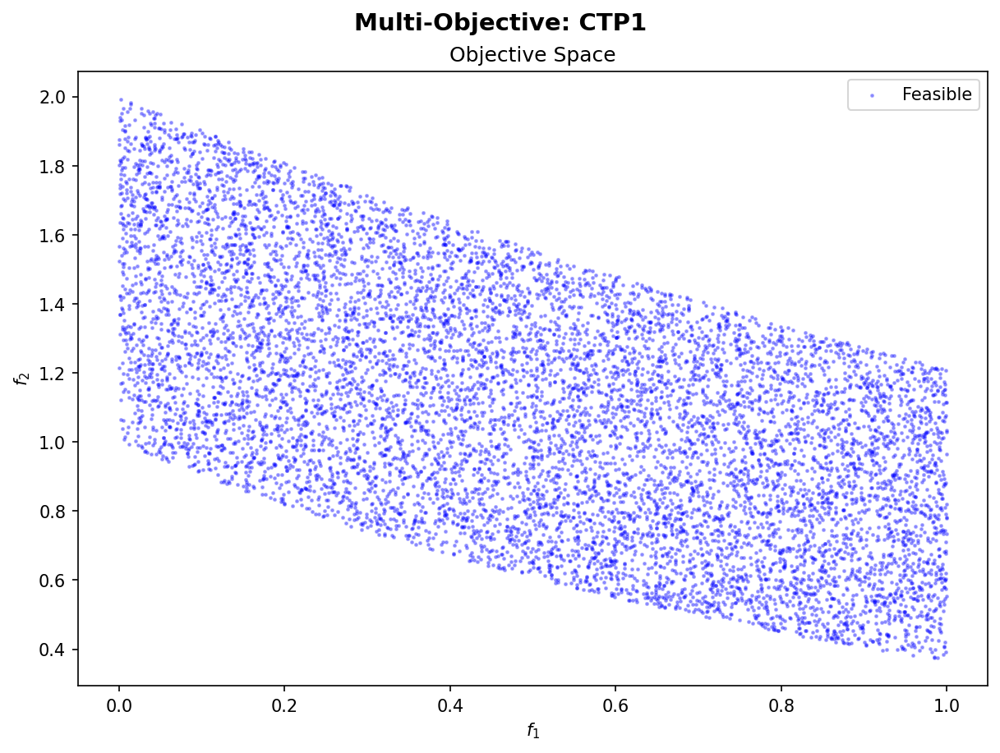
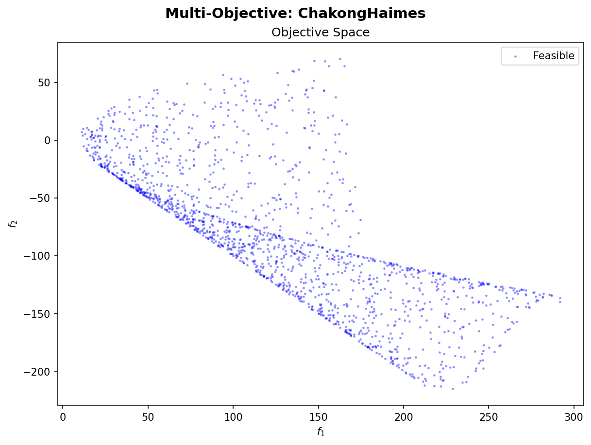
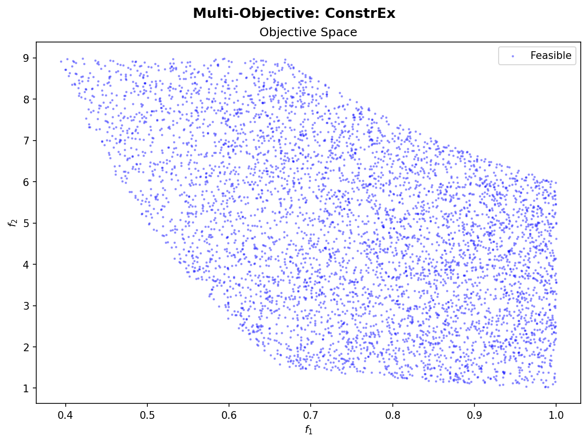
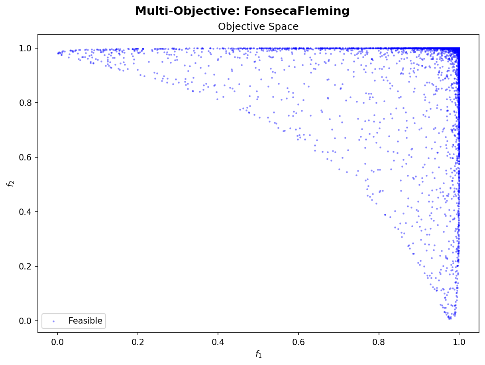
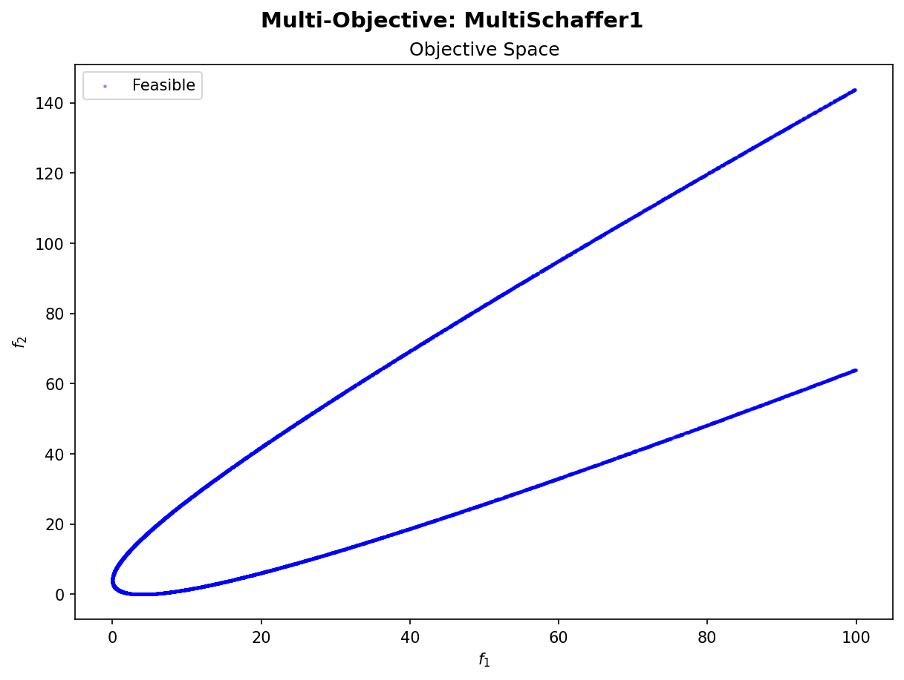
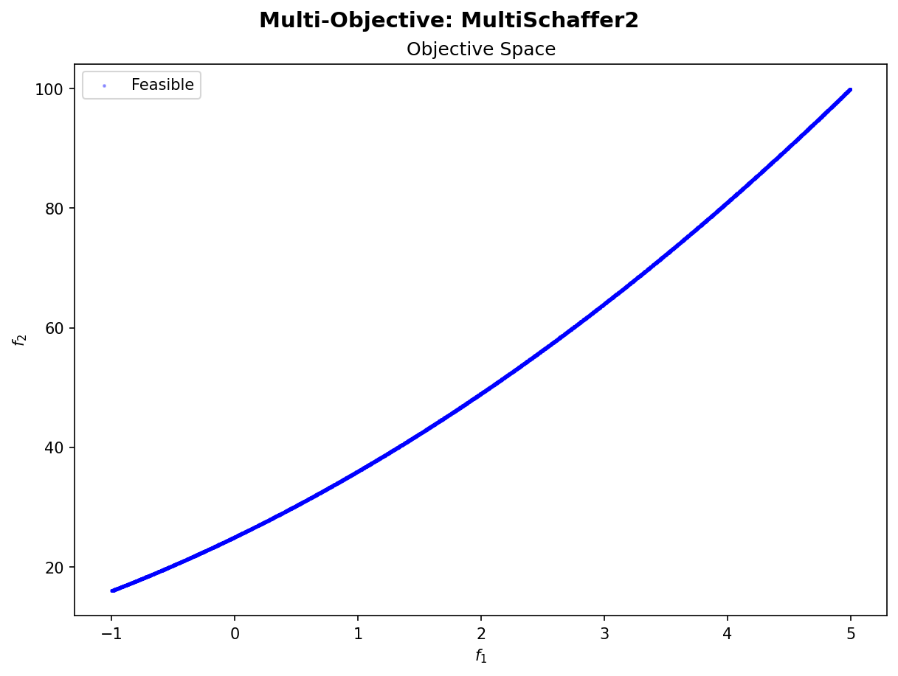
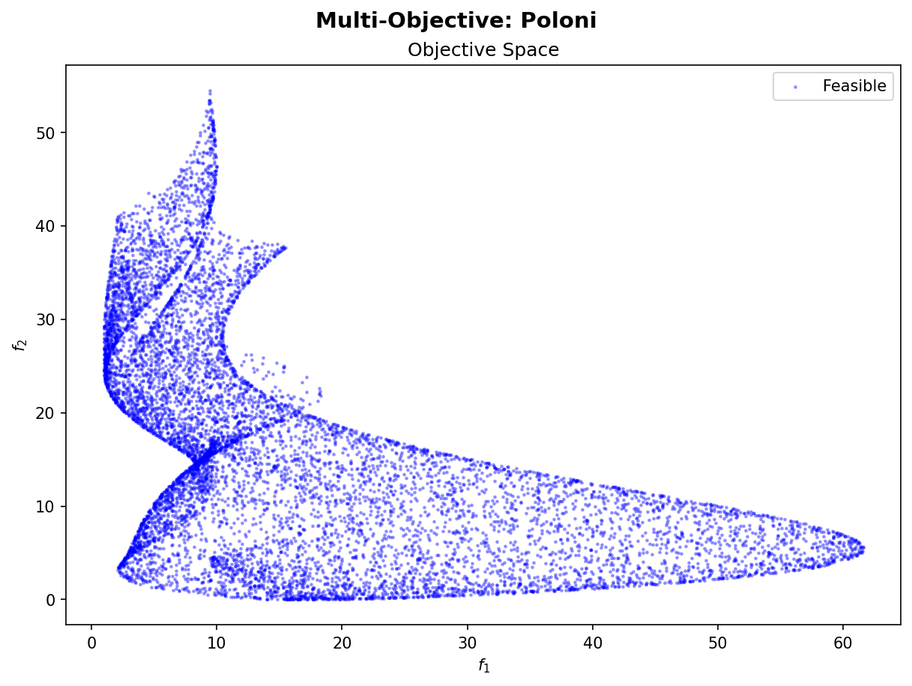
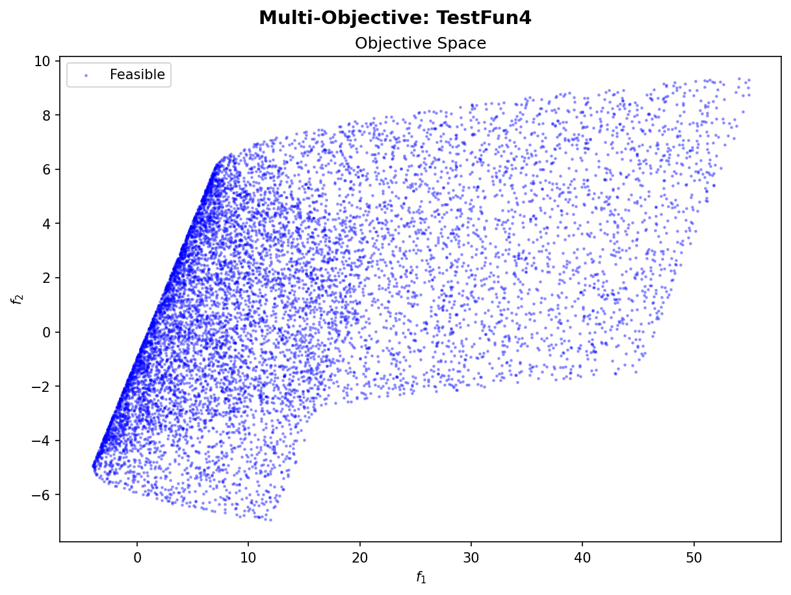
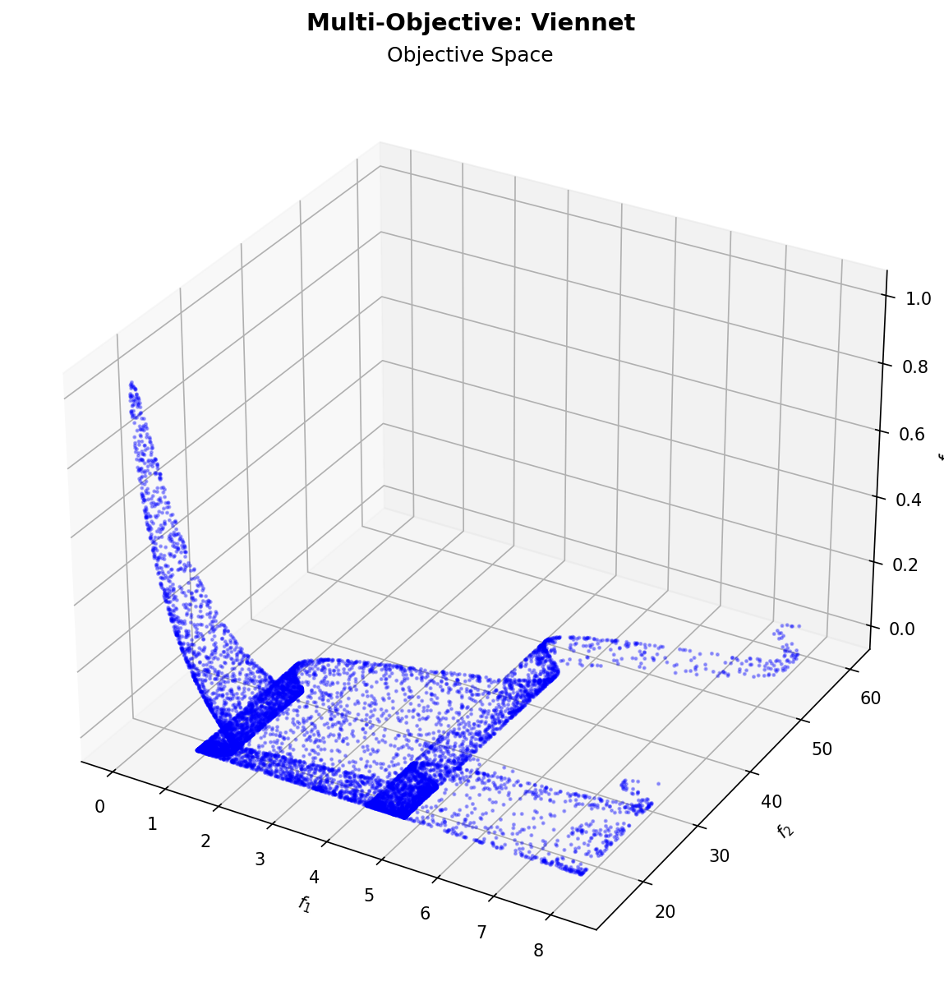

# Multi-Objective Test Problems

Each figure shows the Pareto front approximation in objective space, obtained by sampling the design space.

---

## BinhKorn

---

## CTP1

---

## ChakongHaimes

---

## ConstrEx

---

## FonsecaFleming

---

## MultiSchaffer1

---

## MultiSchaffer2

---

## Poloni

---

## TestFun4

---

## Viennet

---

